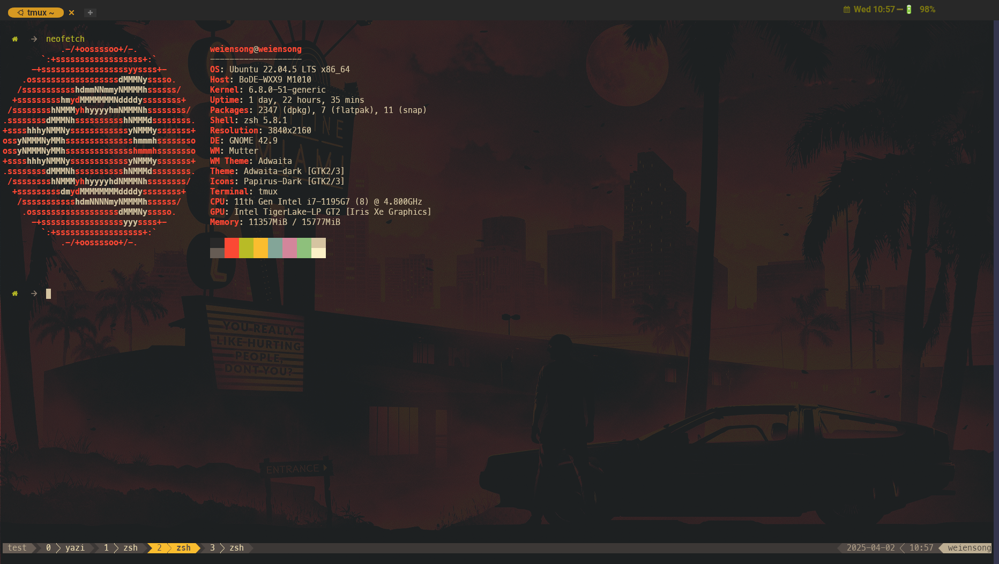
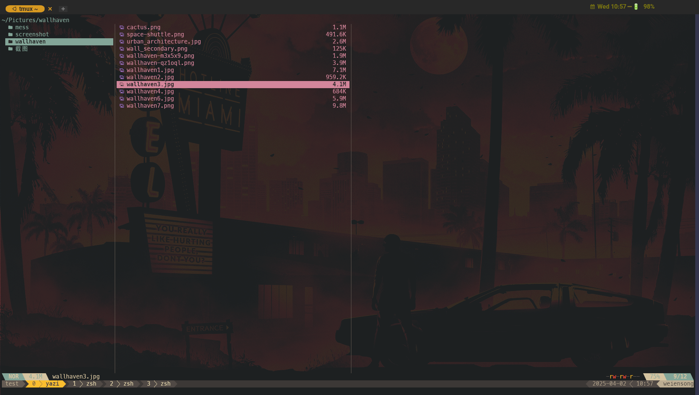
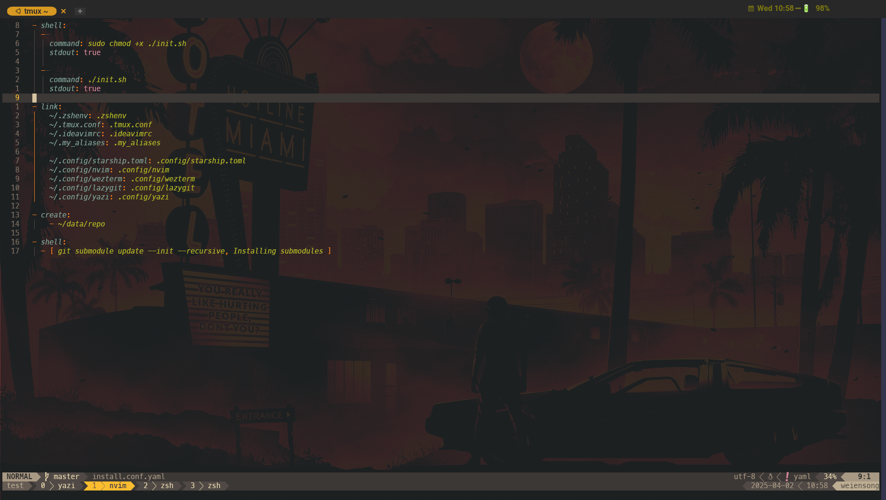
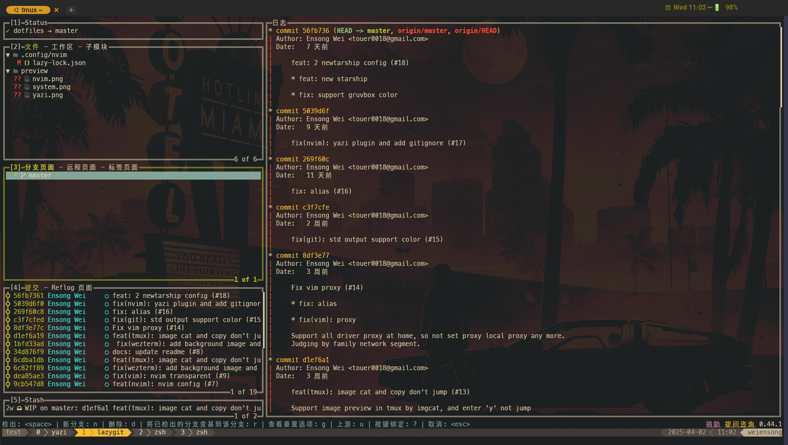

# touero's dotfiles

based [dotbot](https://github.com/anishathalye/dotbot)

# usega

```
git clone https://github.com/touero/dotfiles.git && cd dotfiles
```

> [!IMPORTANT]
> check  [dotbot command line arguments](https://github.com/anishathalye/dotbot/blob/master/README.md#command-line-arguments)


# preview

## Ubuntu





