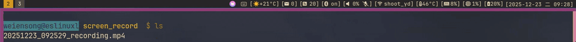

# dotfiles
Based [dotbot](https://github.com/anishathalye/dotbot) manage.  




## Usega

> [!CAUTION]
> It might link to configuration files you don't need, please check  [dotbot command line arguments](https://github.com/anishathalye/dotbot/blob/master/README.md#command-line-arguments).  
```
# Clone this repo on github:
git clone https://github.com/touero/dotfiles.git
# Or on codeberg:
git clone https://codeberg.org/touero/dotfiles.git

# Check dotbot help:
./install --help

# Execute with root privileges:
sudo ./install [OPTIONS]

# Execute with current user privileges:
./install [OPTIONS]
```


> [!NOTE]
> - The software repositories in different versions of Ubuntu or Macos contain different versions of software, and you may need to compile it manually.  
> - It is best to make the execution result of the written script idempotent.

> [!TIP]
> theoretical sequence:  
> - [`boot`](https://github.com/touero/dotfiles/blob/master/boot): first initialization execution.
> - [`install_packages`](https://github.com/touero/dotfiles/blob/master/install_packages): install dependency packages.
> - [`install`](https://github.com/touero/dotfiles/blob/master/install): dotbot install script.

## Software I used
As a vimer, I prefer software similar to vim operations, which is free as in freedom is better.
```
- /usr/bin/sh:                          dash
- Login Shell:                          zhs
- Shell Prompt Custom:                  starship
- Terminlal Multiplexer:                tmux
- Terminal Emulator:                    foot | wezterm
- WM/Compositor:                        sway
- Status Bar:                           waybar
- Notifycation Daemon:                  mako
- Fuzzy Finder:                         wmenu | fzf
- Application Launcher:                 wmenu
- Text Editor:                          neovim
- Picture Editor:                       gimp
- Email:                                neomutt + isync
- Encryption Decryption:                gpg
- File Manager:                         yazi | ranger
- Web Browser:                          firefox | chrome | qutebrowser
- Rss Reader:                           newsboat
- Downloader:                           curl | wget
- Screenshot:                           grim + slurp + swappy
- Clipboard Manager:                    wl-clipboard + cliphist
- Input Method:                         fcitx5
- Video Player:                         mpv
- Image Viewer:                         swayimg
- Network Manager:                      networkmanager
- Bluetooth Manager:                    bluetui
- Screen Recording:                     ffmpeg
- Dotfiles Manager:                     git & dotbot
```

## GPG public Key
Import my GPG public key from `openpgp`:
```Shell
gpg --keyserver hkps://keys.openpgp.org --recv-keys FDC87FAB9D3B9D7862F4669E7FDDD6633D9DC07C
```

or [download/copy](https://github.com/touero/dotfiles/blob/master/touero.asc) the content of file.
  

The emails I send should carry my signature.  
If you want to send me GPG-encrypted mail, please make sure key is same in [key servers](https://keys.openpgp.org/search?q=touer0018%40gmail.com), [github](https://github.com/touero/dotfiles/blob/preview_menu/touero.asc) and [codeberg](https://codeberg.org/touero/dotfiles/src/branch/master/touero.asc).
If you want an encrypted email response, you must send me your key. I don't promise to keep it permanently if we don't talk often, so if you talk with me again a year later you should send it again.


## License
License them under [GNU GPL-3.0](./LICENSE). There is no warranty, to the extend permitted by applicable law.

I mark some configurations and scripts from others, and I mark them as modifications or enhancements I made.

Work from others should be clearly identified.
