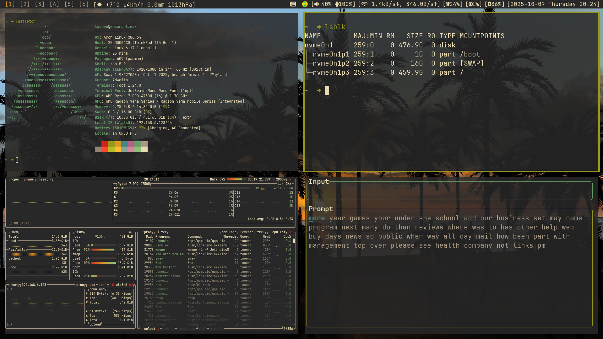

# dotfiles
Based [dotbot](https://github.com/anishathalye/dotbot) manage.  




## Usega

> [!CAUTION]
> It might link to configuration files you don't need, please check  [dotbot command line arguments](https://github.com/anishathalye/dotbot/blob/master/README.md#command-line-arguments).  
```
# Clone this repo on github:
git clone https://github.com/touero/dotfiles.git
# Or on codeberg:
git clone https://codeberg.org/touero/dotfiles.git

# Check dotbot help:
./install --help

# Execute with root privileges:
sudo ./install [OPTIONS]

# Execute with current user privileges:
./install [OPTIONS]
```


> [!NOTE]
> - The software repositories in different versions of Ubuntu or Macos contain different versions of software, and you may need to compile it manually.  
> - It is best to make the execution result of the written script idempotent.

> [!TIP]
> theoretical sequence:  
> - [`boot`](https://github.com/touero/dotfiles/blob/master/boot): first initialization execution.
> - [`install_packages`](https://github.com/touero/dotfiles/blob/master/install_packages): install dependency packages.
> - [`install`](https://github.com/touero/dotfiles/blob/master/install): dotbot install script.

## software I used
As a vimer, I prefer software similar to vim operations, which is free as in freedom is better.
```
- /usr/bin/sh:                          dash
- Login Shell:                          zhs
- Terminlal Multiplexer:                tmux
- Terminal Emulator:                    foot | wezterm
- WM/Compositor:                        sway
- Status Bar:                           waybar
- Application Launcher:                 wmenu
- Fuzzy Finder:                         fzf
- Text Editor:                          neovim
- Picture Editor:                       gimp
- Email:                                neomutt + mbsync
- Encryption Decryption:                gpg
- File Manager:                         yazi | ranger
- Web Browser:                          firefox | chrome | qutebrowser
- Rss Reader:                           newsboat
- Downloader:                           curl | wget
- Screenshot:                           grim + slurp + swappy
- Clipboard Manager:                    wl-clipboard + cliphist
- Dotfiles Manager:                     git & dotbot
```

## License
A few scripts or config files come from others, and a credit to the respective authors should be spotted.

Referenced:
- [gnuunixchat/dotfiles](https://github.com/gnuunixchad/dotfiles)

[GNU GPL-3.0](./LICENSE)
